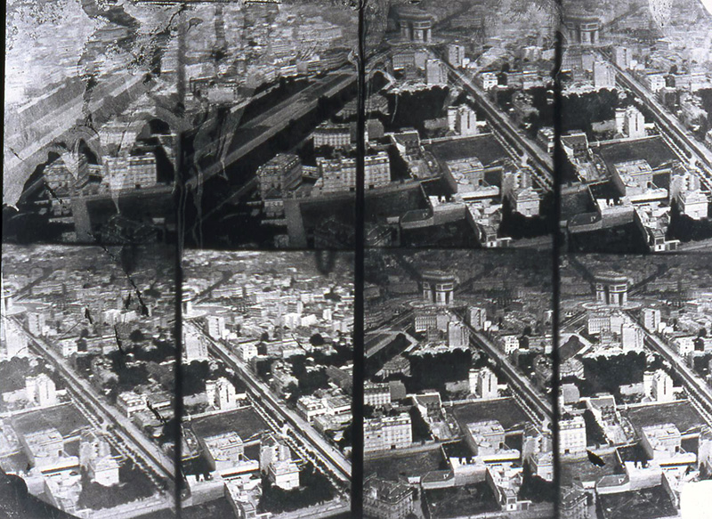
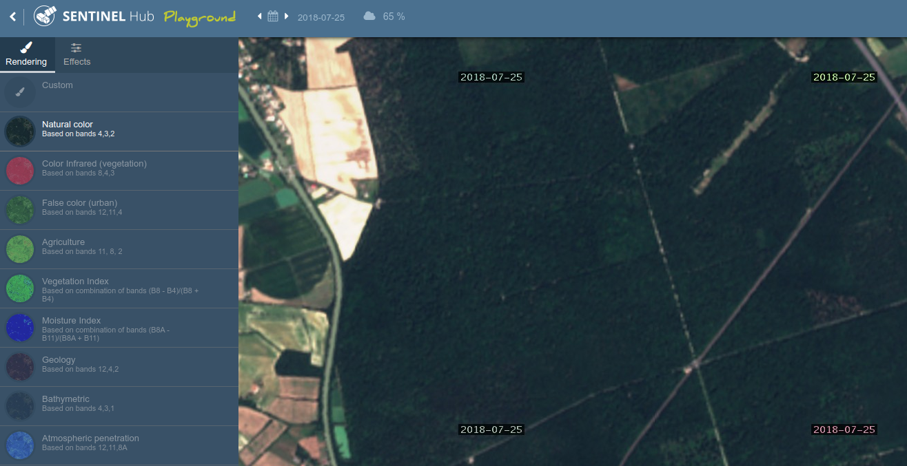
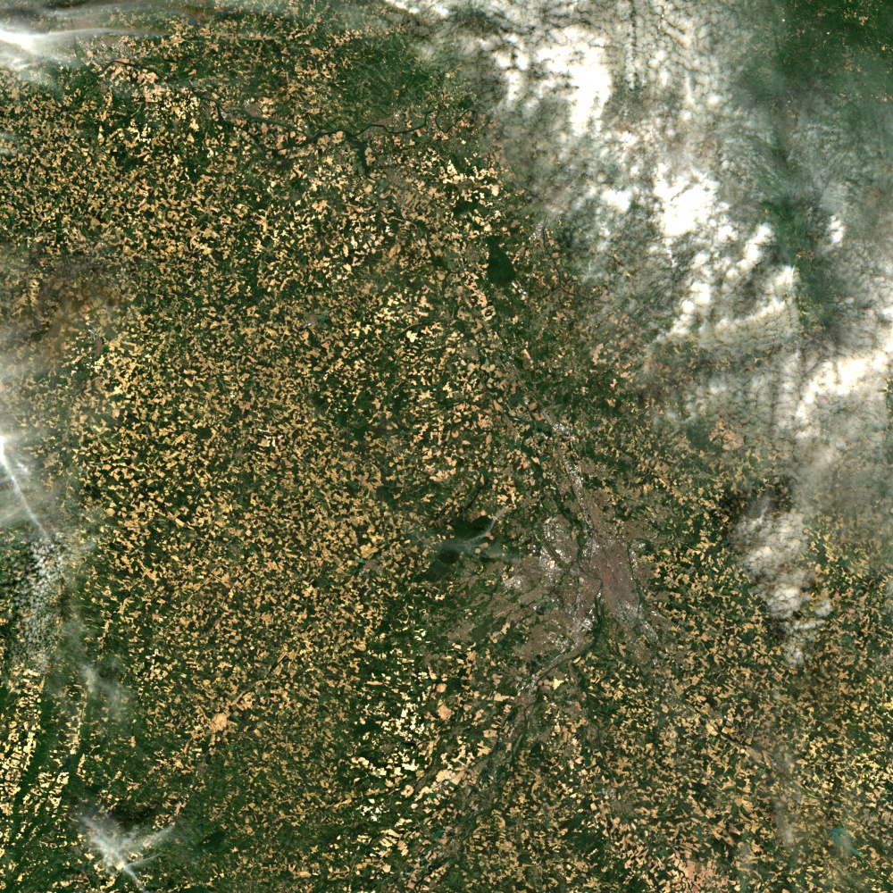

# Introduction à la télédétection


[TOC]

## Planning prévisionnel

| Ordre | Date            | Horaire     | Thème                                                                                   |
|-------|-----------------|-------------|-----------------------------------------------------------------------------------------|
| 1     | Mer. 18/09/2019 | 13h30/17h30 | Théorie Découverte à partir de sentinel-hub                                             |
| 2     | Ven. 20/09/2019 | 13h30/16h30 | Traitements simples dans Qgis et OTB à partir d’une image Sentinel-2 de taille réduite. |
| 3     | Lun. 23/09/2019 | 13h30/17h30 | Connaitre, choisir puis générer un indice spectral                                      |
| 4     | Ven. 27/09/2019 | 8h/12h      | Apprentissage automatique avec OTB et Dzetsaka                                          |
| 5     | Ven. 27/09/2019 | 13h30/16h30 | DHI (Dynamic Habitat Index)                                                             |
| 6     | Ven. 04/10/2019 | 13h30/16h30 | PARTIEL                                                                                 |


------


## Cours 1

### Théorie

La théorie [cf fichier lesson.pdf] vous sera directement présentée.

### Sentinel-Playground

La télédétection ça se passe de plus en plus en ligne.

Après une partie théorique, vous allez pouvoir maintenant manier un outil et découvrir la télédétection à travers l'application en ligne Sentinel-Hub Playground [https://www.sentinel-hub.com/explore/sentinel-playground](https://www.sentinel-hub.com/explore/sentinel-playground). 
Sentinel Playground permet, à la manière de Google Maps/Earth, de voir les images du monde entier mais cette fois-ci en choisissant la date qui vous intéresse grâce aux deux satellites européens Sentinel-2. 



**Pour vous familiariser avec l'outil, je vous propose d'essayer de faire apparaître au mieux les feuillus des résineux dans la forêt de Montech : [tiny.cc/jeufeuillusresineux](http://tiny.cc/jeufeuillusresineux).**

Vous pouvez bien entendu changer :

- de date (printemps, automne, été, hiver ?),
- de bande spectrale (bleu, vert, rouge, infra-rouge…),
- d'affichage d'indices/de couleurs (en remplaçant le rouge par l'infra-rouge par exemple)

À noter que l'utilisation avancée de Sentinel-Playground permet de calculer des indices avec plusieurs dates, comme pour [calculer la couverture neigeuse mensuelle](https://apps.sentinel-hub.com/sentinel-playground-temporal/?source=S2&lat=42.77826738996885&lng=0.44219970703125&zoom=10&preset=CUSTOM&layers=B04,B03,B02&maxcc=95&gain=1.0&temporal=true&gamma=1.0&time=2015-01-01%7C2019-03-30&atmFilter=ATMCOR&showDates=false&evalscript=LyoKU291cmNlOiBAbmthcmFzaWFrIC8gd3d3LmthcmFzaWFrLm5ldAoKTW9udGhseSBzbm93IHJlcG9ydC4KVGlyZWQgb2Ygd2FpdGluZyB0aGUgcGVyZmVjdCBpbWFnZSB3aXRoIG5vIGNsb3VkIHRvIHNob3cgdGhlIHNub3cgY292ZXIgPyBUaGlzIG1vbnRobHkgc25vdyByZXBvcnQgaXMgaGVyZSBmb3IgeW91LgpUaGlzIHNjcmlwdCB3aWxsIGZpbmQgd2hlcmUgdGhlIHNub3cgaXMgcGVyc2lzdGVudCB3aXRoaW4gdGhlIGxhc3QgMzEgZGF5cyAoZnJvbSBjaG9zZW4gZGF0ZSkuCkluIG9yZGVyIHRvIHdlbGwgcmVwcmVzZW50IHRoZSBsYW5kLWNvdmVyLCB0aGUgc2NyaXB0IHdpbGwgc3RvcmUgZWFjaCBwZXJ0aW5lbnQgZGF0ZSBpbiBhIGxpc3QgYW5kIHdpbGwgcmVwcmVzZW50cyB0aGUgbWVkaWFuIHZhbHVlLgoKVGhpcyBzZW50aW5lbC0yIHNjcmlwdCB2b2x1bnRhcmlseSBjb2xvciBpbiBncmVlbiB0aGUgaW1hZ2UgdG8gYmV0dGVyIGRpZmZlcmVudGlhdGUgdGhlIHNub3cgZnJvbSB0aGUgb3RoZXIgbGFuZC1jb3Zlci4KClNjcmlwdCByZXF1aXJlcyBtdWx0aS10ZW1wb3JhbCBwcm9jZXNzaW5nLgoqLwoKLy8gUHV0IDMgdG8gaGF2ZSBzeW50aGVzaXMgb2YgdGhlIGxhc3QgMyBtb250aHMKdmFyIG51bWJlck9mTW9udGhzVG9Vc2UgPSAxOwovLyBUaHJlc29sZCB0byBjb25zaWRlciBwaXhlbCBhcyBzbm93CnZhciBORFNJdGhyZXNvbGQgPSAwLjIwOwovLyBJbiBvcmRlciB0byBkaXNtaXNzIHNub3cgZnJvbSB3YXRlcgp2YXIgcmVkVGhyZXNvbGQgPSAwLjI7Ci8vIEluIG9yZGVyIHRvIGRpc21pc3MgY2xvdWRzCnZhciBibHVlVGhyZXNvbGQgPSAwLjE4OwoKZnVuY3Rpb24gc2V0dXAoZHNzKSB7CiAgICBzZXRJbnB1dENvbXBvbmVudHMoW2Rzcy5CMDIsIGRzcy5CMDMsIGRzcy5CMDQsIGRzcy5CMTFdKTsKICAgIHNldE91dHB1dENvbXBvbmVudENvdW50KDMpOwp9CgpmdW5jdGlvbiBORFNJKHNhbXBsZSkgewogICAgcmV0dXJuICgoc2FtcGxlLkIwMyAtIHNhbXBsZS5CMTEpIC8gKDAuMDEgKyBzYW1wbGUuQjAzICsgc2FtcGxlLkIxMSkpOwp9CgpmdW5jdGlvbiBtZWRpYW4odmFsdWVzKSB7CiAgICAvLyBmcm9tIGh0dHBzOi8vc3RhY2tvdmVyZmxvdy5jb20vcXVlc3Rpb25zLzQ1MzA5NDQ3L2NhbGN1bGF0aW5nLW1lZGlhbi1qYXZhc2NyaXB0CiAgICBpZiAodmFsdWVzLmxlbmd0aCA9PT0gMCkgcmV0dXJuIDA7CgogICAgdmFsdWVzLnNvcnQoZnVuY3Rpb24oYSwgYikgewogICAgICAgIHJldHVybiBhIC0gYjsKICAgIH0pOwoKICAgIHZhciBoYWxmID0gTWF0aC5mbG9vcih2YWx1ZXMubGVuZ3RoIC8gMik7CgogICAgaWYgKHZhbHVlcy5sZW5ndGggJSAyKQogICAgICAgIHJldHVybiB2YWx1ZXNbaGFsZl07CgogICAgcmV0dXJuICh2YWx1ZXNbaGFsZiAtIDFdICsgdmFsdWVzW2hhbGZdKSAvIDIuMDsKfQoKZnVuY3Rpb24gZXZhbHVhdGVQaXhlbChzYW1wbGVzLCBzY2VuZXMpIHsKICAgIC8vIGZvciBzbm93IHNjZW5lCiAgICBsZXQgc25vd3lDb3VudCA9IDA7CiAgICBsZXQgc25vd0IwMiA9IFtdOwogICAgbGV0IHNub3dCMDMgPSBbXTsKICAgIGxldCBzbm93QjA0ID0gW107CgogICAgLy8gZm9yIHVuc25vdyBzY2VuZQogICAgbGV0IEIwMiA9IFtdOwogICAgbGV0IEIwMyA9IFtdOwogICAgbGV0IEIwNCA9IFtdOwoKICAgIC8vIHRvIG1hbmFnZSBpbWFnZSBsZW5ndGggYmV0d2VlbiB0aWxlcwogICAgcmVhbFNhbXBsZUxlbmd0aCA9IDA7CgogICAgZm9yIChpID0gMDsgaSA8IHNhbXBsZXMubGVuZ3RoOyBpKyspIHsKICAgICAgICAvLyBpbiBvcmRlciB0byBhdm9pZCBibGFjayBwaXhlbCAodGhlIG9uZXMgYmV0d2VlbiB0aWxlcykKCiAgICAgICAgaWYgKChzYW1wbGVzW2ldLkIwMiA%2BIDApIHx8IChzYW1wbGVzW2ldLkIwMyA%2BIDApKSB7CiAgICAgICAgICAgIHJlYWxTYW1wbGVMZW5ndGgrKzsKCiAgICAgICAgICAgIC8vIGZvdW5kIHNub3cKICAgICAgICAgICAgaWYgKChORFNJKHNhbXBsZXNbaV0pID4gTkRTSXRocmVzb2xkKSAmIChzYW1wbGVzW2ldLkIwNCA%2BIHJlZFRocmVzb2xkKSkgewogICAgICAgICAgICAgICAgc25vd3lDb3VudCsrOwogICAgICAgICAgICAgICAgc25vd0IwMi5wdXNoKHNhbXBsZXNbaV0uQjAyKTtzbm93QjAzLnB1c2goc2FtcGxlc1tpXS5CMDMpO3Nub3dCMDQucHVzaChzYW1wbGVzW2ldLkIwNCk7CiAgICAgICAgICAgIH0KICAgICAgICAgICAgLy8gbWF5YmUgaXQgaXMgc25vd3kgYnV0IGNsb3Vkcy4uLgogICAgICAgICAgICAvLyBzbyBjb3VudCBhcyBzbm93IGJ1dCBub3QgbWVtb3JpemluZyBwaXhlbCB2YWx1ZXMuCiAgICAgICAgICAgIGVsc2UgaWYgKChzYW1wbGVzW2ldLkIwMiA%2BIGJsdWVUaHJlc29sZCkgJiAoc2FtcGxlc1tpXS5CMDQgPiByZWRUaHJlc29sZCkpIHsKICAgICAgICAgICAgICAgIHNub3d5Q291bnQrKzsKICAgICAgICAgICAgfQogICAgICAgICAgICAvLyBub3Qgc25vdwogICAgICAgICAgICBlbHNlIGlmIChzYW1wbGVzW2ldLkIwMiA8IGJsdWVUaHJlc29sZCkgewogICAgICAgICAgICAgICAgQjAyLnB1c2goc2FtcGxlc1tpXS5CMDIpO0IwMy5wdXNoKHNhbXBsZXNbaV0uQjAzKTtCMDQucHVzaChzYW1wbGVzW2ldLkIwNCk7CiAgICAgICAgICAgIH0KICAgICAgICB9CiAgICB9CgogICAgaWYgKChzbm93QjAyID09IDApICYgKEIwMi5sZW5ndGggPT0gMCkpIHsKICAgICAgICAvLyBubyB2YWxpZCBkYXRhIGF2YWlsYWJsZSA6IGRhcmsgZ3JlZW4gY29sb3IKICAgICAgICBjb2xvck1hcCA9IFsuMDUsLjIsLjA1XTsKICAgIH0gZWxzZSBpZiAoKHNub3d5Q291bnQgPT0gcmVhbFNhbXBsZUxlbmd0aCkgfHwgKEIwMi5sZW5ndGg8MSkpIHsKICAgICAgICAvLyBzbm93Q29sb3JNYXAKICAgICAgICBjb2xvck1hcCA9IFsxLjEgKiBtZWRpYW4oc25vd0IwNCksIDEuMyAqIG1lZGlhbihzbm93QjAzKSwgMS4xICogbWVkaWFuKHNub3dCMDIpXTsKICAgIH0gZWxzZSBpZiAoQjAyLmxlbmd0aCA%2BPSAxKSB7CiAgICAgICAgLy8gZGVmYXVsdENvbG9yTWFwCiAgICAgICAgY29sb3JNYXAgPSBbMS41ICogbWVkaWFuKEIwNCksIDIuNSAqIG1lZGlhbihCMDMpLCAxLjUgKiBtZWRpYW4oQjAyKV07CiAgICB9CgogICAgcmV0dXJuIGNvbG9yTWFwOwp9CgpmdW5jdGlvbiBmaWx0ZXJTY2VuZXMoc2NlbmVzLCBpbnB1dE1ldGFkYXRhKSB7CiAgICByZXR1cm4gc2NlbmVzLmZpbHRlcihmdW5jdGlvbihzY2VuZSkgewogICAgICAgIHJldHVybiBzY2VuZS5kYXRlLmdldFRpbWUoKSA%2BPSAoaW5wdXRNZXRhZGF0YS50by5nZXRUaW1lKCkgLSAobnVtYmVyT2ZNb250aHNUb1VzZSAqIDMxICogMjQgKiAzNjAwICogMTAwMCkpOwogICAgfSk7Cn0K).

### EO Browser

Sentinel-hub permet de consulter facilement des données Sentinel-1 et 2 mais aussi Landsat. Notez qu'un autre outil, [EO Browser](https://apps.sentinel-hub.com/eo-browser/) très proche de Sentinel-hub et développé par la même entreprise permet :

- de générer des images animées
- d'avoir l'évolution temporelle des pixels/de polygones sur une période donnée


### Google Earth Engine

Il ne sera pas étudié pendant ce cours l'outil de Google nommé Google Earth Engine (GEE), cependant, il est important de le connaitre un minimum.

À partir d'une console javascript, vous pouvez directement intérargir avec les images satellites stockées chez Google, plus besoin de télécharger les images, et de puissants processeurs pour calculer des indices, des algorithmes... Cependant, si aujourd'hui GEE est gratuit, il est fort à parier que son coût de fonctionnement devrait être assez élevé.

Afin de connaitre le potentiel de GEE sans y passer trop de temps, je vous propose de regarder [la liste gérée par Philippe Gärtner qui recense les nombreux scripts GEE](https://philippgaertner.github.io/2019/04/earth-engine-apps-inventory/).

Pour vous inscrire et essayer GEE, ça se passe sur [https://code.earthengine.google.com](https://code.earthengine.google.com).


------


## Cours 2

### Objectif du cours :
1. Apprendre à visualiser une image et ses bandes (créer un raster contenant les bandes S2)
2. Créer des compositions colorées dans QGIS
3. Générer un indice spectral (NDVI ou NDWI) 
3. Segmenter une image selon un seuil (à partir du NDVI par exemple)


### Les logiciels utilisés
- **QGIS** pour visualiser et faire des traitements simples,
- **OTB** pour des traitements plus complexes ou plus facilement reproductions (en mode cli, c'est-à-dire en ligne de commande, ou gui, c'est-à-dire à travers une interface graphique).

### Image Sentinel-2



Comme les images Sentinel-2 sont relativement lourdes (~2go), je vous ai réduis l'emprise de l'acquisiton et  j'ai supprimé quelques images (luminance et les fichiers de reflectance surface).

L'image est disponible au format zip : [data/SENTINEL2A_20190516-105902-454_L2A_T31TCJ_D_V2-1_LIGHT.zip](data/SENTINEL2A_20190516-105902-454_L2A_T31TCJ_D_V2-1_LIGHT.zip).

Répondez aux questions suivantes en vous aidant des métadonnées : 

- Qui a produit cette image ?
- Quel est le pourcentage de nuages dans l'image ?
- À quelle heure à été faite la prise de vue ?
- Quel est le niveau de correction  (1A, 1C, 2A) ? Et que cela signifie-t-il ?
- A-t-on un masque des nuages ?

### Une date, des images

Comme vous avez pu le voir, pour chaque acquisition vous avez donc de multiples fichiers.

Afin de visualiser les images une par une, il est recommandé d'utiliser un **raster virtuel**. Vous pourrez ainsi combiner plusieurs images entre elles, et de résolutions différentes !

Essayez dans **QGIS** de visualiser l'image Sentinel-2 fournie avec respectivement :

- une composition RGB,
- une composition infra-rouge couleur (c'est-dire que l'infra-rouge sera mis dans le canal du rouge)
- une composition colorée SWIR (c'est-à-dire, le rouge dans le canal bleu, la bande 8A dans le vert, et la bande 12 dans le canal rouge) qui mélange à la fois des bandes à 10m de résolution spatiale et des bandes à 20m.l


### Calcul du NDVI

Le NDVI (Normalized Difference Vegetation Ratio) est un indice spectral qui se calcule à partir de la bande rouge et infrarouge. Sa formule est la suivante :
```
NDVI = ((NIR - R)/(NIR + R))
```
Cet indice génère des valeurs entre -1 à 1, où les valeurs supérieures à 0.5 correspondent à la végétation très active et avec un fort taux de couverture (forêt, et agriculture).

Pour économiser de l'espace disque, il est d'usage de **multiplier par 100 le NDVI** afin d'avoir des valeurs entières situées entre -100 et 100. Dans ce cas, vous devez choisir un format entier pour votre GeoTiff : 

| Nom    | Type   | Valeur min | Valeur max |
|--------|--------|------------|------------|
| Byte   | Entier | 0          | 255        |
| Int16  | Entier | -32768     | 32767      |
| Uint16 | Entier | 0          | 65535      |
| Int32 | Entier | -2147483648 | 2147483647 |
| Uint32  | Entier   | 0 | 4294967295  |
| Float16 | Flottant | -65504.00 | 65504.00 |

Afin de bien vous familiariser avec les outils, je vous conseille d'apprendre à calculer le NDVI à partir :

- des deux images (l'image de la bande rouge et celle de l'infrarouge) ,
- du raster virtuel généré précédemment.


#### À partir d'otb BandMath CLI (mode geek)

Dans le terminal de commandes (Ctrl+T sous ubuntu) ou cherchez terminal dans le barre de recherche, puis tapez :
`otbcli_BandMath -help`

Il vous faudra remplir les arguments suivants : 

- `-il` avec le nom de votre image
- `-out` avec le nom de l'image que vous voulez enregistrer (i.e. ndvi.tif par exemple), suivant du format comme vu ci-dessus.
- `-exp` l'expression permettant de calculer le NDVI. im1b1 signifie par exemple la bande 1 dans l'image 1. im1b3 signifie la bande 3 de l'image 1, im2b1 signifie la bande 1 dans l'image 2.

#### À partir d'otb BandMath GUI (mode petit geek)

Une interface OTB est disponible dans QGIS, il vous suffit alors de recherche BandMath dans la boîte à outils de traitements. L'expression sera la même que celle précédemment trouvée.

#### À partir de la calculatrice raster (mode utilisateur SIG)

La dernière méthode consiste à utiliser la calculatrice raster présente dans QGIS afin de calculer le NDVI.

### Visualisation du NDVI

Visualiser maintenant les 3 NDVI obtenus et répondez à ces questions : 

- Quelle méthode préférez-vous ? Pourquoi ?
- Trouvez-vous des différences de résultats selon la méthode ? Si oui, pourquoi ? Si non, pourquoi pas ?
- Trouvez-vous des différences de taille de fichier ?
- Selon vous, quel avantage y-a-t-il à utiliser l'interface en ligne de commande ?


------


## Cours 3 [En finalisation] 

Maintenant que vous êtes familiarisé la notion d'indice spectral et comment en calculer, allons plus loin !

Retrouver pour chaque indice spectral la bande Sentinel-2 correspondante puis générer l'indice.

### Liste des indices à calculer

| Nom | Nom détaillé | Formule |
|-----|--------------|---------|
| **Vegetation** |
| NDVI | Normalised Difference Vegetation Index | `(Rouge - NIR) / (Rouge + NIR)` |
| EVI | Enhanced Vegetation Indices | `( 2.5 * ( NIR - Rouge ) ) / ( (NIR + 6 * Rouge - 7.5 * Bleu ) + 1 )`|
| LChloC | Leaf Chlorophyll Content | `B7 / B5`* |
| NDBR | Normalized Difference NIR/SWIR Normalized Burn Ratio | `(NIR - SWIR) / (NIR + SWIR)` |
| **Eau** |
| NDWI | ND Water Index | `(NIR - MIR) / (NIR + MIR)` |
| **Neige** |
| NDSI | Snow Index | `(Vert - MIR) / (Vert + MIR)` |

*Pour cette indice, la bande Sentinel-2 vous est directement communiquée.

### Segmenter votre image

À partir d'un indice de votre choix, créer un seuil permettant de différencier différentes classes d'occupation de sol (eau/forêt/route/nuage).

Par exemple, à partir du NDVI, créez une nouvelle image avec plusieurs classes (1 = Forêt, 2 = non-forêt, 3 = Eau) par exemple.

Vous pouvez utiliser comme précédemment, soit BandMath, soit la calculatrice raster.

Nommez votre fichier `OCS.tif` et choisissez bien votre format (entier/flottant...).


------


## Cours 4 [En cours d'écriture] 

L'apprentissage automatique, que vous connaissez peut-être plus sous le nom *machine learning*,  consiste à apprendre à travers les statistiques un modèle qui pourra par la suite 
prédire des données qu'il n'aura pas utilisé pour l'apprentissage.

Dans notre cas, ce qui nous intéresse est d'utiliser les pixels comme données d'apprentissage pour pouvoir cartographier l'occupation du sol. Cependant, en plus des pixels, nous devons communiquer ce qu'on appelle un label, c'est-à-dire un identifiant unique pour chaque classe (forêt, eau, route...).

### Créer des polygones d'entrainement

Pour chaque classe que vous aurez définies (eau, route, forêt...), créer au moins 6 polygones et ajouter un champ qui contiendra un identifiant unique par classe.

Par exemple, pour chaque polygone (une ligne = un polygone) : 

| Id | Nom | Classe |
|----|-----|--------|
| 1  | Forêt | 1 |
| 2  | Forêt | 1 |
| 3  | Eau | 2 |

### Entrainer un modèle

Différents algorithmes, KNN, GMM très rapides mais pas forcément les plus performants.

Random Forest très réputé et très performant dans l'ensemble.

Deux méthodes pour apprendre un modèle depuis QGIS : 

- **OTB** : avec trainImagesClassifier
- **Dzetsaka** : avec Train algorithm ou directement depuis la fenêtre

Puis prédire une image : 
- **OTB** : Image Classifier
- **Dzetsaka** : Predict model

### Évaluer le modèle

Pour évaluer le modèle, il convient de garder de côté quelques polygones pour chaque classe. Ainsi, on pourra vérifier si nos polygones sont bien prédits par le modèle appris précédemment.

- Calculer la matrice de confusion et l'accord global (nombre de pixels bien prédits / nombre total de pixels bien et mal prédits)


------


## Cours 5 [En cours d'écriture] 

En cours d'écriture...