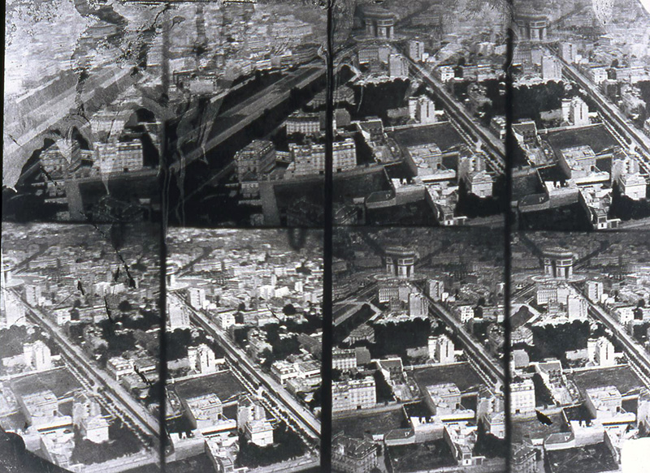
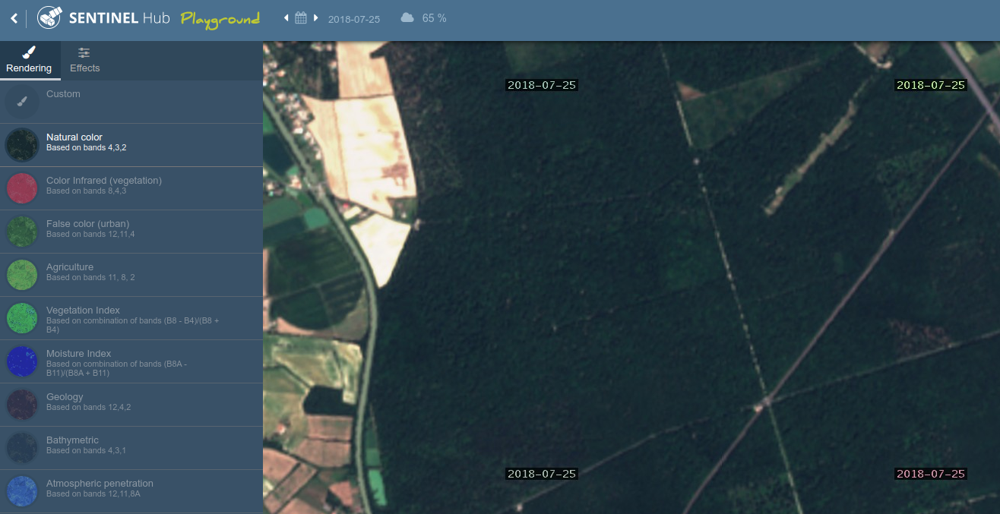
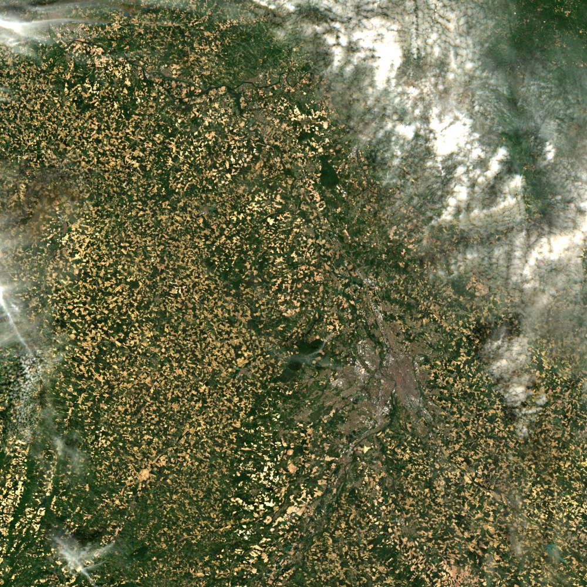

# Introduction à la télédétection


[TOC]

## Planning prévisionnel

| Ordre | Date            | Horaire     | Thème                                                                                   |
|-------|-----------------|-------------|-----------------------------------------------------------------------------------------|
| 1     | Mer. 18/09/2019 | 13h30/17h30 | Théorie Découverte à partir de sentinel-hub                                             |
| 2     | Ven. 20/09/2019 | 13h30/16h30 | Traitements simples dans Qgis et OTB à partir d’une image Sentinel-2 de taille réduite. |
| 3     | Lun. 23/09/2019 | 13h30/17h30 | Connaitre, choisir puis générer un indice spectral                                      |
| 4     | Ven. 27/09/2019 | 8h/12h      | Apprentissage automatique avec OTB et Dzetsaka                                          |
| 5     | Ven. 27/09/2019 | 13h30/16h30 | DHI (Dynamic Habitat Index)                                                             |
| 6     | Ven. 04/10/2019 | 13h30/16h30 | PARTIEL                                                                                 |

## Cours 1
### Théorie

La théorie vous sera directement présentée.

### La télédétection ça se passe aussi en ligne

Après une partie théorique, vous allez pouvoir maintenant manier un outil et découvrir la télédétection à travers l'application en ligne Sentinel-Hub Playground [https://www.sentinel-hub.com/explore/sentinel-playground](https://www.sentinel-hub.com/explore/sentinel-playground). 
Sentinel Playground permet, à la manière de Google Maps/Earth, de voir les images du monde entier mais cette fois-ci en choisissant la date qui vous intéresse grâce aux deux satellites européens Sentinel-2. 



**Pour vous familiariser avec l'outil, je vous propose d'essayer de faire apparaître au mieux les feuillus des résineux dans la forêt de Montech : [tiny.cc/jeufeuillusresineux](http://tiny.cc/jeufeuillusresineux).**

Vous pouvez bien entendu changer :

- de date (printemps, automne, été, hiver ?),
- de bande spectrale (bleu, vert, rouge, infra-rouge…),
- d'affichage d'indices/de couleurs (en remplaçant le rouge par l'infra-rouge par exemple)

## Cours 2
### Objectif du cours :
1. Apprendre à visualiser une image et ses bandes (créer un raster contenant les bandes S2)
2. Générer un indice spectral (NDVI ou NDWI) 
3. Segmenter une image selon un seuil (à partir du NDVI par exemple)


### Les logiciels utilisés
- **QGIS** pour visualiser et faire des traitements simples,
- **OTB** pour des traitements plus complexes ou plus facilement reproductions (en mode cli, c'est-à-dire en ligne de commande, ou gui, c'est-à-dire à travers une interface graphique).

### Image Sentinel-2



Répondez aux questions suivantes en vous aidant des métadonnées : 

- Qui a produit cette image ?
- Quel est le pourcentage de nuages dans l'image ?
- À quelle heure à été faite la prise de vue ?
- Quel est le niveau de correction  (1A, 1C, 2A) ? Et que cela signifie-t-il ?
- A-t-on un masque des nuages ?

Une fois la réponse à ces questions, essayez dans **QGIS** de visualiser l'image avec respectivement :

- une composition RGB,
- une composition infra-rouge couleur (c'est-dire que l'infra-rouge sera mis dans le canal du rouge)

### Calcul du NDVI

Le NDVI (Normalized Difference Vegetation Ratio) est un indice spectral qui se calcule à partir de la bande rouge et infrarouge. Sa formule est la suivante :
```
NDVI = ((IR - R)/(IR + R))
```
Cet indice génère des valeurs entre -1 à 1, où les valeurs supérieures à 0.5 correspondent à la végétation très active et avec un fort taux de couverture (forêt, et agriculture).

Pour économiser de l'espace disque, il est d'usage de **multiplier par 100 le NDVI** afin d'avoir des valeurs entières situées entre -100 et 100. Dans ce cas, vous devez choisir un format entier pour votre GeoTiff : 

| Nom    | Type   | Valeur min | Valeur max |
|--------|--------|------------|------------|
| Byte   | Entier | 0          | 255        |
| Int16  | Entier | -32768     | 32767      |
| Uint16 | Entier | 0          | 65535      |
| Int32 | Entier | -2147483648 | 2147483647 |
| Uint32  | Entier   | 0 | 4294967295  |
| Float16 | Flottant | -65504.00 | 65504.00 |

#### À partir d'otb BandMath CLI (mode geek)
Dans le terminal de commandes (Contrôle+T) ou cherchez terminal dans le barre de recherche, puis tapz :
`otbcli_BandMath -help`

Il vous faudra remplir les arguments suivants : 

- `-il` avec le nom de votre image
- `-out` avec le nom de l'image que vous voulez enregistrer (i.e. ndvi.tif par exemple), suivant du format comme vu ci-dessus.
- `-exp` l'expression permettant de calculer le NDVI. im1b1 signifie par exemple la bande 1 dans l'image 1. im1b3 signifie la bande 3 de l'image 1, im2b1 signifie la bande 1 dans l'image 2.

#### À partir d'otb BandMath GUI (mode petit geek)

Une interface OTB est disponible dans QGIS, il vous suffit alors de recherche BandMath dans la boîte à outils de traitements. L'expression sera la même que celle précédemment trouvée.

#### À partir de la calculatrice raster (mode utilisateur SIG)

La dernière méthode consiste à utiliser la calculatrice raster présente dans QGIS afin de calculer le NDVI.

### Visualisation du NDVI

Visualiser maintenant les 3 NDVI obtenus et répondez à ces questions : 

- Quelle méthode préférez-vous ? Pourquoi ?
- Trouvez-vous des différences de résultats selon la méthode ? Si oui, pourquoi ? Si non, pourquoi pas ?
- Trouvez-vous des différences de taille de fichier ?
- Selon vous, quel avantage y-a-t-il à utiliser l'interface en ligne de commande ?

